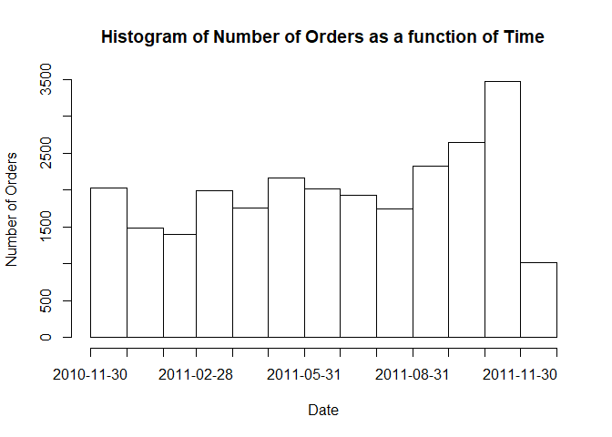
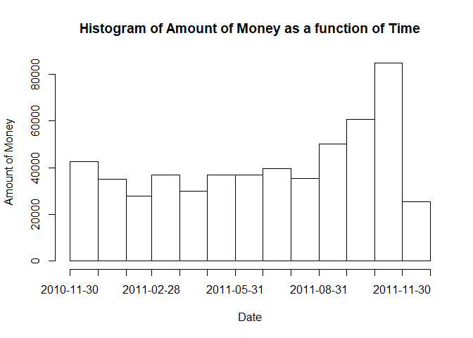

ECommerce Data
================
Galen Cheung
11/18/2021

# E-Commerce Data

This data set
([source](https://archive.ics.uci.edu/ml/datasets/online+retail#))
consists of details of orders made in different countries from December
2010 until December 2011. The company is a UK-based online retailer that
mainly sells unique all-occasions gifts. Many of its customers are
wholesalers. Take a look at some suggestions to analyze at the end of
this template.

### Load packages

``` r
options(tidyverse.quiet = TRUE)
library(tidyverse) #import library
library(skimr) #import library
```

### Load your Data

``` r
data <- readr::read_csv('C:/Users/galen/Documents/R/Portfolio/ECommerce_Data/Online_Retail.csv') #import data
```

### View Data

``` r
# Summarize the dataset using skimr
skim(data)
```

|                                                  |        |
|:-------------------------------------------------|:-------|
| Name                                             | data   |
| Number of rows                                   | 541909 |
| Number of columns                                | 8      |
| \_\_\_\_\_\_\_\_\_\_\_\_\_\_\_\_\_\_\_\_\_\_\_   |        |
| Column type frequency:                           |        |
| character                                        | 5      |
| numeric                                          | 3      |
| \_\_\_\_\_\_\_\_\_\_\_\_\_\_\_\_\_\_\_\_\_\_\_\_ |        |
| Group variables                                  | None   |

Data summary

**Variable type: character**

| skim_variable | n_missing | complete_rate | min | max | empty | n_unique | whitespace |
|:--------------|----------:|--------------:|----:|----:|------:|---------:|-----------:|
| InvoiceNo     |         0 |             1 |   6 |   7 |     0 |    25900 |          0 |
| StockCode     |         0 |             1 |   1 |  12 |     0 |     4070 |          0 |
| Description   |      1454 |             1 |   1 |  35 |     0 |     4211 |          0 |
| InvoiceDate   |         0 |             1 |  14 |  16 |     0 |    23260 |          0 |
| Country       |         0 |             1 |   3 |  20 |     0 |       38 |          0 |

**Variable type: numeric**

| skim_variable | n_missing | complete_rate |     mean |      sd |        p0 |      p25 |      p50 |      p75 |  p100 | hist  |
|:--------------|----------:|--------------:|---------:|--------:|----------:|---------:|---------:|---------:|------:|:------|
| Quantity      |         0 |          1.00 |     9.55 |  218.08 | -80995.00 |     1.00 |     3.00 |    10.00 | 80995 | ▁▁▇▁▁ |
| UnitPrice     |         0 |          1.00 |     4.61 |   96.76 | -11062.06 |     1.25 |     2.08 |     4.13 | 38970 | ▁▇▁▁▁ |
| CustomerID    |    135080 |          0.75 | 15287.69 | 1713.60 |  12346.00 | 13953.00 | 15152.00 | 16791.00 | 18287 | ▇▇▇▇▇ |

### Data Dictionary

**online_retail.csv**

| Variable    | Explanation                                                                                                                       |
|-------------|-----------------------------------------------------------------------------------------------------------------------------------|
| InvoiceNo   | A 6-digit integral number uniquely assigned to each transaction. If this code starts with letter ‘c’ it indicates a cancellation. |
| StockCode   | A 5-digit integral number uniquely assigned to each distinct product.                                                             |
| Description | Product (item) name                                                                                                               |
| Quantity    | The quantities of each product (item) per transaction                                                                             |
| InvoiceDate | The day and time when each transaction was generated                                                                              |
| UnitPrice   | Product price per unit in sterling (pound)                                                                                        |
| CustomerID  | A 5-digit integral number uniquely assigned to each customer                                                                      |
| Country     | The name of the country where each customer resides                                                                               |

### Answer interesting questions

Now you get to explore this exciting dataset! Can’t think of where to
start? Try your hand at these questions:

-   Find out which country has the biggest clients in terms of total
    orders or most money paid.

``` r
options(dplyr.summarise.inform = FALSE)
data %>%
  group_by(Country) %>% #to get groups of country
  summarize(Total_Money_Paid_By_Country = sum(Quantity*UnitPrice)) %>% #to get total amount of money per country
  arrange(desc(Total_Money_Paid_By_Country)) #sort by most money to least money
```

    ## # A tibble: 38 x 2
    ##    Country        Total_Money_Paid_By_Country
    ##    <chr>                                <dbl>
    ##  1 United Kingdom                    8187806.
    ##  2 Netherlands                        284662.
    ##  3 EIRE                               263277.
    ##  4 Germany                            221698.
    ##  5 France                             197404.
    ##  6 Australia                          137077.
    ##  7 Switzerland                         56385.
    ##  8 Spain                               54775.
    ##  9 Belgium                             40911.
    ## 10 Sweden                              36596.
    ## # ... with 28 more rows

``` r
data %>%
  group_by(Country, InvoiceNo) %>% #to get groups of country, and group by InvoiceNo
  summarize(count_of_invoice = n()) %>% #to get county of individual invoices by country
  summarize(Count_of_Orders_By_Country = n()) %>% #total the counts of individual invoices for the country
  arrange(desc(Count_of_Orders_By_Country)) #sort most number of invoices to least number
```

    ## # A tibble: 38 x 2
    ##    Country        Count_of_Orders_By_Country
    ##    <chr>                               <int>
    ##  1 United Kingdom                      23494
    ##  2 Germany                               603
    ##  3 France                                461
    ##  4 EIRE                                  360
    ##  5 Belgium                               119
    ##  6 Spain                                 105
    ##  7 Netherlands                           101
    ##  8 Switzerland                            74
    ##  9 Portugal                               71
    ## 10 Australia                              69
    ## # ... with 28 more rows


-   Find the smallest portion of customers that drive the biggest
    portion of the company revenue. See the [80/20
    rule](https://en.wikipedia.org/wiki/Pareto_principle).

``` r
data %>% #load data
  mutate(cust_total = UnitPrice*Quantity) %>% #create a sum of goods per item
  select(Quantity, UnitPrice, CustomerID, cust_total) %>% #select quantity, price, customer ID, and total
  group_by(CustomerID) %>% #group by customer
  summarize(cust_total = sum(cust_total)) %>% #sum the customer's purchase
  na.omit() %>% #no more NA values
  arrange(desc(cust_total)) %>% #sort
  top_frac(.2) #get top 20% of spenders 
```

    ## # A tibble: 874 x 2
    ##    CustomerID cust_total
    ##         <dbl>      <dbl>
    ##  1      14646    279489.
    ##  2      18102    256438.
    ##  3      17450    187482.
    ##  4      14911    132573.
    ##  5      12415    123725.
    ##  6      14156    113384.
    ##  7      17511     88125.
    ##  8      16684     65892.
    ##  9      13694     62653.
    ## 10      15311     59419.
    ## # ... with 864 more rows

-   Plot the number of orders made or amount of money paid in function
    of time.

``` r
plt_data_num_of_orders <- data %>%
  select(InvoiceNo, InvoiceDate) %>% #get InvoiceNo and Invoice Date
  unique() #Unique InvoiceNo and Date

NumOfOrders_Date_Time <- as.factor(plt_data_num_of_orders$InvoiceDate)
NumOfOrders_Date <- strptime(NumOfOrders_Date_Time, format = '%m/%d/%Y %H:%M')

hist(as.Date(plt_data_num_of_orders$InvoiceDate,
             format = "%m/%d/%Y %H:%M"), #Format the date
            breaks = 'months', #set monthly breaks
            freq = T, #keep frequency
            xlab = 'Date', #x label
            ylab = 'Number of Orders', #y label
            main = 'Histogram of Number of Orders as a function of Time') #title
```

<!-- -->

``` r
plt_data_money_paid <- data %>%
  mutate(total = UnitPrice * Quantity) %>%
  select(Quantity, UnitPrice, total, InvoiceDate) %>%
  group_by(InvoiceDate)

hist(as.Date(plt_data_money_paid$InvoiceDate,
             format = "%m/%d/%Y %H:%M"), #Format the date
            breaks = 'months', #set monthly breaks
            freq = T, #keep frequency
            xlab = 'Date', #x label
            ylab = 'Amount of Money', #y label
            main = 'Histogram of Amount of Money as a function of Time') #title
```

<!-- -->
